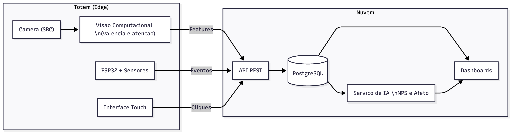

# FIAP - Faculdade de Informática e Administração Paulista

<p align="center">
<a href="https://www.fiap.com.br/"></a>
</p>

<br>

# Totem Inteligente FlexMedia com IA

## Grupo 50 R

## 👨‍🎓 Integrantes:

- Gabriel Henrique de Oliveira Moraes
- Thiago Limongi Faria dos Reis
- Gabriel Luiz Fagundes

## 👩‍🏫 Professores:

### Tutoras

- Ana Cristana dos Santos

---

## 📜 Descrição

O **Totem Inteligente FlexMedia** é um projeto desenvolvido em parceria com a empresa **FlexMedia**, que atua na criação de soluções digitais interativas para espaços culturais e comerciais.

O objetivo é construir um **totem inteligente com Inteligência Artificial**, capaz de **coletar, processar e analisar interações humanas**, como presença, atenção, emoções e engajamento, gerando insights em tempo real e um **NPS (Net Promoter Score) estimado por IA**.

A proposta combina sensores físicos (ESP32, PIR, toque), **visão computacional** (análise de atenção e afeto via câmera SBC), **IA em nuvem** (para predição e aprendizado contínuo), e **dashboards interativos** (para gestores de ambiente).

Além de fornecer experiências mais personalizadas aos visitantes, o projeto se preocupa com **segurança e privacidade dos dados**, adotando um modelo **Privacy by Design**, onde nenhuma imagem é armazenada, apenas métricas anônimas são processadas.

---

## 📡 Arquitetura Técnica da Solução

### **Visão Geral**

<p align="center">

</p>

O Totem é composto por três camadas principais:

- **Edge (Totem físico)** → coleta e processamento inicial (sensores e câmera).
- **Nuvem (Cloud)** → armazenamento, APIs, IA e dashboards.
- **Interface (UI)** → interação direta com o visitante (toque e exibição de conteúdo).

### **Pipeline de Dados e IA**

<p align="center">

</p>

1. **Sensores e Câmera** capturam presença, atenção e emoções básicas (valência/arousal).
2. **ESP32 e SBC (Raspberry/Jetson)** convertem os sinais físicos em dados digitais.
3. **API REST** recebe, valida e grava os eventos no **banco de dados (PostgreSQL)**.
4. **Serviço de IA** calcula o **NPS estimado** com base em dados de atenção e engajamento.
5. **Dashboards** exibem métricas e insights para a equipe da FlexMedia.

---

## ⚙️ Coleta de Dados e Sensores

### Dispositivos utilizados:

- **ESP32** — microcontrolador principal; coleta sinais de sensores e envia via Wi-Fi.
- **Sensor PIR** — detecta presença e tempo de permanência.
- **Sensor capacitivo** — registra interações físicas (toques).
- **LDR** — ajusta automaticamente o brilho da tela.
- **Câmera SBC (ou ESP32-CAM)** — analisa atenção, número de pessoas e emoções sem armazenar imagens.

### Fluxo físico:

1. Sensor detecta movimento → ESP32 cria uma nova sessão.
2. Câmera identifica presença e atenção → extrai features de valência/arousal.
3. Dados são enviados em JSON via HTTPS para o backend.
4. O backend processa, armazena e repassa para dashboards e IA.

---

## 🧩 Estrutura de Dados

**Banco:** PostgreSQL (com colunas JSONB para flexibilidade).

**Entidades principais:**

- `totems` → informações físicas do dispositivo.
- `sessions` → período ativo de interação.
- `sensor_events` → eventos de sensores (toque, presença, LDR).
- `session_aggregates` → agregados por sessão (métricas de engajamento).
- `vision_ticks` → medições de atenção/emoção por janela de tempo (futuro).
- `affect_sessions` → agregados por sessão (valência, arousal, dwell time, gaze mean) (futuro).

**Exemplo de evento de sensor registrado:**

```json
{
  "event_type": "touch",
  "timestamp": "2025-01-15T14:30:00Z",
  "value": 1,
  "duration": 1.2,
  "touch_type": "long",
  "totem_id": "TOTEM-001",
  "session_id": "uuid"
}
```

**Exemplo de agregação de sessão:**

```json
{
  "session_id": "uuid",
  "total_touches": 5,
  "short_touches": 3,
  "long_touches": 2,
  "avg_light_level": 650.5,
  "interaction_score": 75.5
}
```

---

## 🤖 Inteligência Artificial Planejada

### **Etapa 1 — Edge AI**

- Processamento de vídeo no dispositivo (SBC / ESP32-CAM);
- Extração de features de atenção e emoção;
- Nenhuma imagem armazenada, apenas vetores numéricos.

### **Etapa 2 — Cloud AI**

- Modelo supervisionado de **Regressão Logística ou KNN**;
- Predição de **NPS estimado** a partir de métricas emocionais e comportamentais;
- Classificação:
  - 0–6 → Detratores
  - 7–8 → Neutros
  - 9–10 → Promotores

---

## ☁️ Infraestrutura de Nuvem

| Camada             | Tecnologia                          | Função                           |
| ------------------ | ----------------------------------- | -------------------------------- |
| **Edge**           | ESP32 / ESP32-CAM / SBC             | Coleta e pré-processamento local |
| **API**            | FastAPI (Python) / NestJS (Node.js) | Recepção e validação de eventos  |
| **Banco de Dados** | PostgreSQL / Supabase               | Armazenamento relacional         |
| **IA/ML**          | Scikit-learn / TensorFlow           | Modelagem e predição             |
| **Dashboard**      | Metabase / Power BI                 | Visualização de resultados       |
| **Cloud Provider** | Oracle / AWS / GCP                  | Hospedagem e segurança           |

---

## 🔒 Segurança e Privacidade

- **Privacy by Design:** nenhum dado pessoal ou imagem é armazenado;
- **Criptografia:** HTTPS + AES-256;
- **Anonimização:** apenas dados agregados são transmitidos;
- **Retenção controlada:** logs e eventos expiram em 90 dias;
- **Conformidade:** aderente à **LGPD** e boas práticas de segurança da informação.

---

## 📁 Estrutura de Pastas

Dentre os arquivos e pastas presentes na raiz do projeto, definem-se:

- **.github/** → automações e configurações do repositório.
- **assets/** → imagens e diagramas (`logo-fiap.png`, `fluxo1.png`, `fluxo2.png`).
- **config/** → arquivos de configuração do ambiente.
- **document/** → documentação do projeto e relatórios FIAP.
- **scripts/** → scripts de setup, migração ou automação.
- **src/** → código-fonte principal (Edge, API e Dashboard).
- **README.md** → este arquivo principal de referência.

---

## 🔧 Como Executar o Código

### Pré-requisitos

**Opção 1: Execução Local**

- Python 3.10+
- PostgreSQL 12+
- pip ou yarn (para instalação de dependências)

**Opção 2: Execução com Docker (Recomendado)**

- Docker 20.10+
- Docker Compose 2.0+

### Instalação

1. **Clone o repositório:**

```bash
git clone <repository-url>
cd enterprise-challenge-flexmedia
```

2. **Instale as dependências:**

```bash
pip install -r requirements.txt
# ou
yarn install
```

3. **Configure o banco de dados:**

   - Crie um arquivo `.env` baseado em `.env.example`
   - Configure as credenciais do PostgreSQL

4. **Inicialize o banco de dados:**

```bash
python src/database/init_db.py
```

### Executando os Componentes

#### 1. Coletor de Dados (Simulação)

```bash
python src/data_collector.py
```

#### 2. Limpeza de Dados

```bash
python src/data_cleaning.py
```

#### 3. Análise Estatística

```bash
python src/analysis/data_analysis.py
```

#### 4. Treinamento do Modelo ML

```bash
python src/ml/touch_classifier.py
```

#### 5. Dashboard Interativo

```bash
streamlit run src/dashboard/app.py
```

O dashboard estará disponível em `http://localhost:8501`

### Executando com Docker (Recomendado)

Para facilitar o setup, o projeto inclui configuração Docker completa:

1. **Configure as variáveis de ambiente:**

```bash
cp .env.example .env
```

2. **Inicie os serviços:**

```bash
docker-compose up -d
```

3. **Acesse o dashboard:**

```
http://localhost:8501
```

4. **Gere dados de exemplo:**

```bash
docker-compose exec api python scripts/generate_sample_data.py --sessions 10
```

Para mais informações sobre Docker, consulte [DOCKER.md](DOCKER.md).

---

## 🗓 Plano de Desenvolvimento

| Sprint | Entregas                                                       | Status                |
| ------ | -------------------------------------------------------------- | --------------------- |
| **1**  | Documentação técnica (escopo, arquitetura, segurança e plano). | ✅ Concluído          |
| **2**  | Integração sensores, banco SQL, análise Python e ML básico.    | ✅ Concluído          |
| **3**  | Dashboards avançados e análise exploratória completa.          | 🔄 Em desenvolvimento |
| **4**  | Modelo de IA funcional (predição de NPS).                      | 📋 Planejado          |

---

## 🧠 Divisão de Responsabilidades

| Função                     | Responsável         | Entregas                        |
| -------------------------- | ------------------- | ------------------------------- |
| Arquiteto                  | Gabriel Oliveira    | Estrutura geral e integração IA |
| Edge (Sensores e Câmera)   | Guilherme Filartiga | Coleta de dados e ESP32         |
| Backend/API e Documentação | Gabriel Luiz        | Modelagem e endpoints           |
| IA e Dashboards            | Thiago Limongi      | Modelos e relatórios            |

---

## 🗃 Histórico de Lançamentos

- **0.2.0** — 01/2025 — Sprint 2: Integração de sensores, banco de dados SQL, análise estatística, ML supervisionado e dashboard.
- **0.1.0** — 11/2025 — Sprint 1: Documentação técnica (escopo, arquitetura, segurança e plano).

---

## 📋 Licença

<p xmlns:cc="http://creativecommons.org/ns#" xmlns:dct="http://purl.org/dc/terms/"><a property="dct:title" rel="cc:attributionURL" href="https://github.com/agodoi/template">MODELO GIT FIAP</a> por <a rel="cc:attributionURL dct:creator" property="cc:attributionName" href="https://fiap.com.br">Fiap</a> está licenciado sobre <a href="http://creativecommons.org/licenses/by/4.0/?ref=chooser-v1" target="_blank" rel="license noopener noreferrer" style="display:inline-block;">Attribution 4.0 International</a>.</p>
